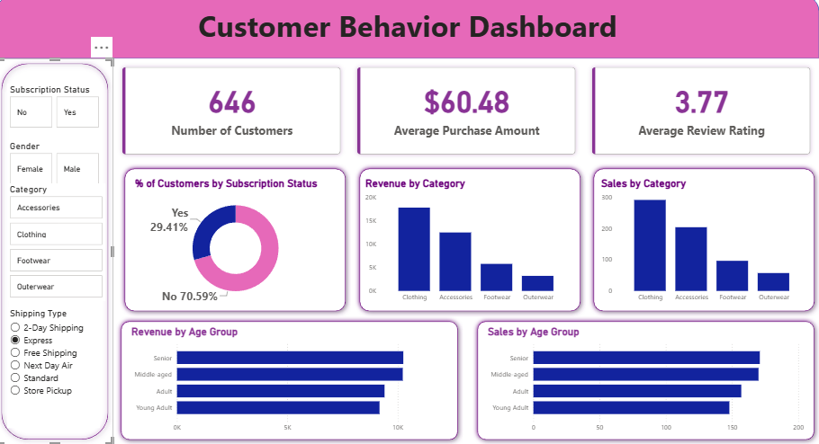

# 👩‍💻 Customer Shopping Behavior Analysis
An end-to-end data analytics project exploring customer shopping behavior using Python, PostgreSQL, and Power BI. The project focuses on identifying purchasing patterns, customer segments, revenue trends, and subscription behavior to support data-driven business decisions.

## Business Problem Statement

A retail company wants to better understand its customers' shopping behavior to improve sales, customer satisfaction, and long-term loyalty.

The company aims to identify purchasing trends across customer demographics and product categories and understand how factors such as discounts, reviews, seasons, and payment preferences influence purchasing decisions.

**Key Business Question:**

How can the company leverage consumer shopping data to identify trends, improve customer engagement, and optimize marketing and product strategies?

## 📌 Project Overview
The goal of this project is to simulate a corporate-grade end-to-end data analytics workflow, demonstrating the ability to translate raw data into strategic business intelligence by:

✅ Data Preparation,Modeling & Exploratory Data Analysis (Python): Clean and transform the raw dataset for analysis.

✅ Data Analysis (SQL): Simulate business transactions, and run queries to extract insights on customer segments, loyalty, and purchase drivers.

✅ Visualization & Insights (Power BI): Build an interactive dashboard that highlights key patterns and trends, enabling stakeholders to make data-driven decisions.

✅ Report and Presentation: Write a clear project report summarizing your key findings and business recommendations. Prepare a presentation that visually communicates insights and actionable recommendations to stakeholders.

## 🛠️ Tools & Technologies

- **Python:** Data cleaning, preprocessing, and exploratory data analysis (EDA)
- **Pandas:** Data manipulation and transformation
- **PostgreSQL:** SQL queries and business analysis
- **Power BI:** Interactive dashboard and data visualization
- **Gamma:** Project presentation and business storytelling
- 
 🗄️ SQL Analysis

1. Revenue by Gender: What is the total revenue generated by male vs. female customers?  

2. Discount Analysis: Which customers used a discount but still spent more than the average purchase amount?  

3. Product Ratings: Which are the top 5 products with the highest average review rating?  

4. Shipping Preferences: How do average purchase amounts compare between Standard and Express shipping?  

5. Subscription Analysis: Do subscribed customers spend more on average and generate higher total revenue than non-subscribers?  

6. Discounted Purchases: Which 5 products have the highest percentage of purchases made using discounts?  

7. Customer Segmentation: How can customers be segmented into New, Returning, and Loyal groups based on previous purchase counts?  

8. Popular Products: What are the top 3 most purchased products within each category?  

9. Repeat Purchases & Subscriptions: Are customers with more than 5 previous purchases also likely to subscribe?  

10. Revenue by Age Group: What is the revenue contribution of each customer age group?

## 📊 Power BI Dashboard
The interactive Customer Shopping Behavior Dashboard provides insights into customer demographics, product categories, purchasing patterns, discounts, customer ratings, payment preferences, and subscription behavior.

## 💡 Key Business Insights
• Customer Behavior: Analyzed purchasing patterns across customer demographics and product categories.

• Purchase Drivers: Identified the impact of discounts, product ratings, and seasonal trends on purchasing decisions.

• Customer Loyalty: Examined subscription patterns and customer preferences to identify opportunities for improving engagement and retention.

## 👩‍💻 About the Author
Hi, I'm Kirti Vishwakarma, an aspiring Data Analyst passionate about turning raw data into meaningful insights using Python, SQL, and Power BI.

Thank you for checking out my project!
